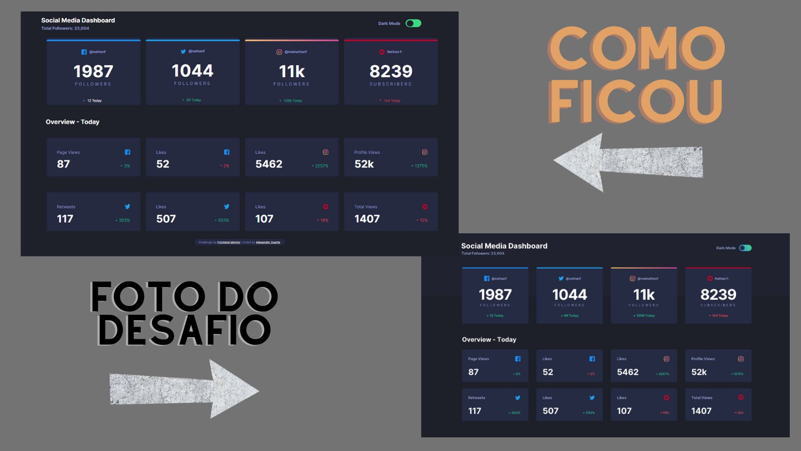

# Olá! :raising_hand: Neste projeto eu criei um painel de controle de mídias com um botão para alterar o tema da página 

## Fique a vontade para sugerir alterações, este é o momento de colocar os meus atuais conhecimentos em prática :)
 

## [Deploy do Website - dê uma olhada de como ficou o site :wink: ](https://painel-social-media.netlify.app/)
 

## Neste projeto eu :books:
- ### Comecei a solidificar os meus conhecimentos em HTML e CSS, 
- ### Comecei a deixar o código Clean
- ### Comecei a utilizar a metodologia BEM (Block Element Modifier) para criar um código legível.
- ### Aprendi mais algumas funções de Java Script 
- ### Aprendi também a colocar as cores em variáveis, mais uma vez facilitando a leitura do código.

## Quais as maiores dificuldades superadas :grey_question:

- ### Implementação do Switch.
- ### Separar as cores por variáveis.
- ### Implementar a função toggle no JavaScript.
- ### Responsividade do projeto.

## Linguagens utilizadas no projeto :computer:
 

 

# Informações de contato :telephone_receiver:

     
     
    
     
     

